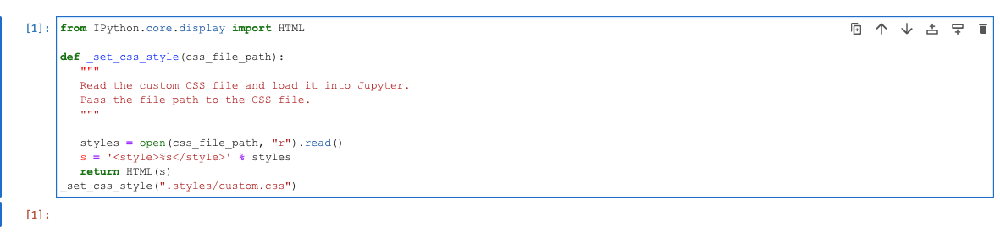
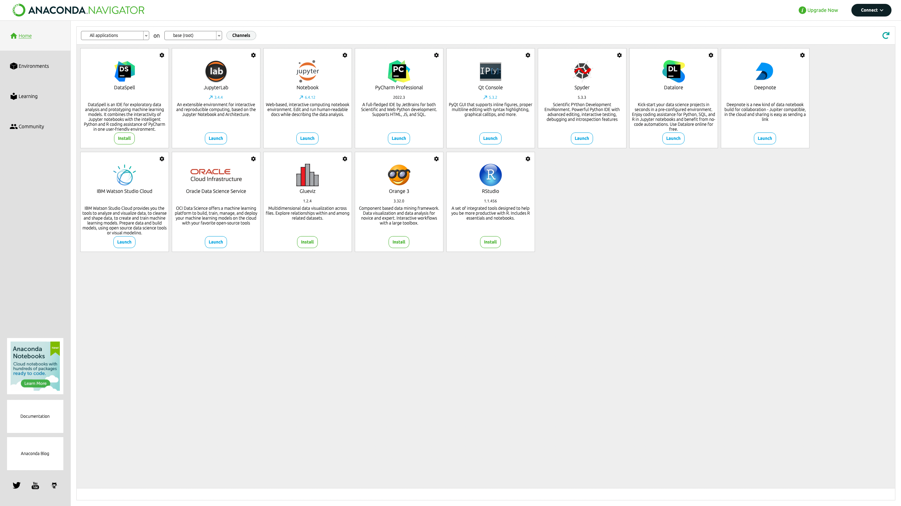
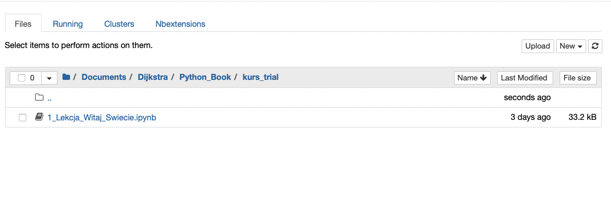

# Cześć! Witaj w naszej próbce  kursu!

Na pewno chcesz już szybko zacząć korzystać z tej próbki! Możesz to zrobić na dwa sposoby.

## Wejść na stronę: 
https://kursprobka.dijkstraenterprise.com/retro/notebooks/?path=1_Lekcja_Witaj_Swiecie.ipynb

__Strona może ładować się kilka sekund!__ Wynika to z tego, że przeglądarka musi ściągnąć ciasteczka do obsługi Pythona (około 10 sekund). Zalecamy używania jej w przeglądarce __Google Chrome__, zdecydowanie __nie zalecamy Safari__.

Następnie kliknij __SHIFT__ i __ENTER__ lub ▶️ (z panelu górnego) w następującej komórce:

Jeśli po lewej stronie wyświetliło się `[1]` po paru sekundach to wszystko działa i możesz zacząc programować! Jeśli wyświetla się `[*]` to odśwież przeglądarkę i/lub kliknij restart kernel `↻` w panelu górnym.

## Pobrać tą próbkę na swój komputer i skonfigurować środowisko programistyczne.

Aby w pełni cieszyć się zawartością tej próbki wykonaj następujące czynności:

1.	Po pobraniu zawartości poniższego repozytorium rozpakuj zawartość do folderu. Możesz to zrobić klikając w plik kursprobka.zip.
2.	Pobierz i zainstaluj oprogramowanie Anaconda do obsługi Pythona ze strony https://www.anaconda.com.
3.	Po instalacji otwórz oprogramowanie __Anaconda-Navigator_- (jest to wygodna platforma do “dowodzenia” Pythonem na Twoim komputerze). Ekran powinien wyglądać tak jak poniżej. 

4.	Kliknij w Launch przy ikonce Jupyter Notebook.
5.	Powinieneś przenieść się wtedy do folderu “głównego” swojego komputera, który wyświetli się w przeglądarce, adres URL to http://localhost:8888/tree

6.	Przejdź do folderu kursprobka. Twój ekran powinien wyglądać podobnie jak na obrazku poniżej.

7.	Kliknij w 1_Lekcja_witaj_świecie.ipynb aby zacząć kurs. 
8. Następnie kliknij __SHIFT__ i __ENTER__ lub ▶️ (z panelu górnego) w następującej komórce:

Jeśli po lewej stronie wyświetliło się `[1]` po paru sekundach to wszystko działa! Jeśli wyświetla się `[*]` to odśwież przeglądarkę i/lub kliknij restart kernel `↻` w panelu górnym.

POWODZENIA! 
